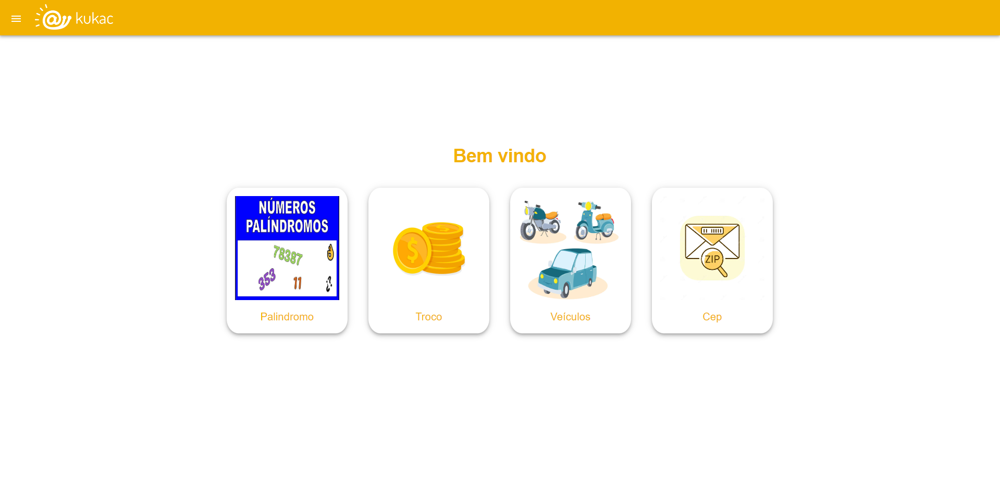
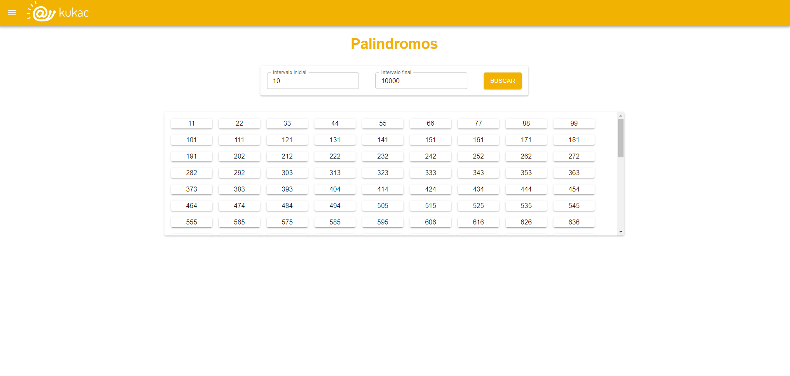
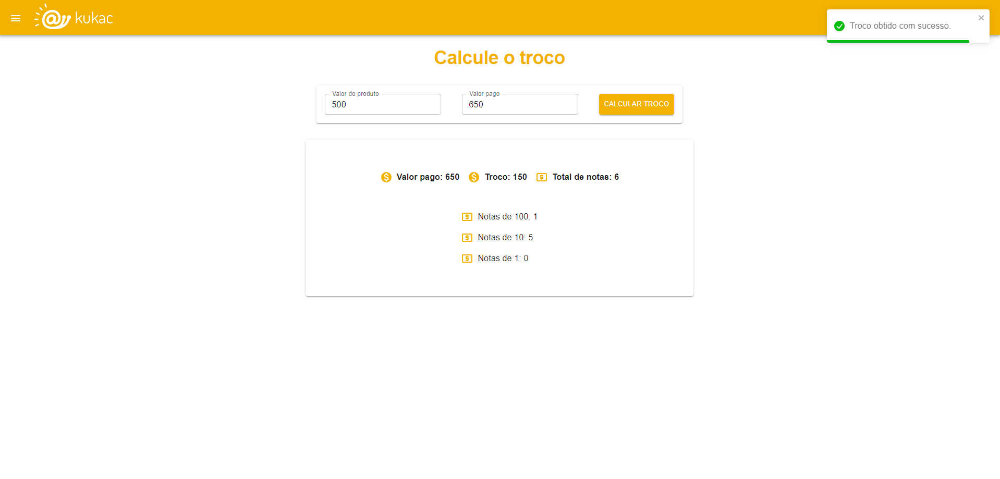
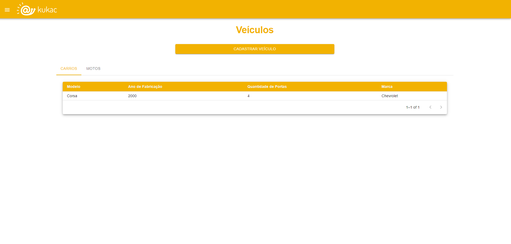
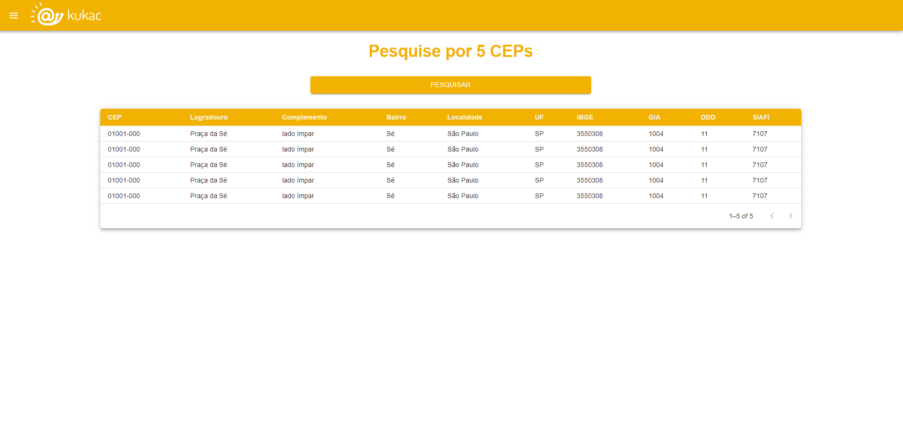

# Desafio Kukac

# 🎯Objetivo:

Desenvolver uma aplicação uma aplicação web dividida em frontend e backend, com o processamento de dados ocorrendo exclusivamente no backend. O projeto engloba a resolução de quatro problemas distintos.

## ❓Problemas a serem resolvidos

### 1. Números Palíndromos

Números palíndromos são aqueles que podem ser lidos da mesma maneira da esquerda para a direita e vice-versa (por exemplo, 929, 44, 97379). Crie um algoritmo que imprima todos os números palíndromos dentro de um intervalo escolhido pelo usuário.

### 2. Cálculo de Troco

Desenvolva um algoritmo que calcule o número mínimo de notas (1, 10 e 100 reais) que um caixa deve fornecer como troco para um cliente que realizou uma compra. O valor da compra e o valor entregue pelo cliente devem ser informados pelo usuário. Além disso, mostre o valor do troco e a quantidade de cada tipo de nota presente no troco.

### 3. Controle de Veículos

Nesta parte, precisamos melhorar o controle dos dados de veículos em nossa garagem. Siga as instruções abaixo:

- Crie uma interface chamada "Veiculo" com os seguintes atributos:
  - Modelo
  - Ano de fabricação
  - Quantidade de Portas
  - Marca

- Crie uma classe chamada "Carro" que herde da interface "Veiculo" e inclua o seguinte atributo:
  - Quantidade de Portas (entre 2 e 4)

- Crie uma classe chamada "Moto" que herde da interface "Veiculo" e inclua os seguintes atributos:
  - Rodas: 2
  - Passageiros (entre 1 e 2)

Solicite ao usuário que preencha as informações sobre o seu veículo e salve os dados em um arquivo JSON para evitar o uso de um banco de dados, uma vez que se assemelhará a um banco NoSQL.

### 4. Consulta de CEPs

O usuário deverá informar 5 CEPs, e a aplicação deve consumir a API VIACep (https://viacep.com.br/) para obter dados sobre esses CEPs. Os CEPs informados pelo usuário devem ser armazenados inicialmente em um array, e o consumo da API deve ser síncrono (aguardando a resposta de um CEP antes de iniciar a requisição do próximo). Após o processamento, exiba os dados na tela.
  
# 🖥️Tecnologias utilizadas:
  

## 📋 Pré-requisitos:

- Docker versão 24.0.5
- Docker compose versão v2.20.2

# 🛠️ Como Utilizar:

1. Clone o repositório para sua máquina utilizando o comando:
  
	`git clone git@github.com:leonardocbrand/kukac-challenge.git`

2. Abra um terminal na **pasta raiz do repositório** e execute o comando <code>npm run compose:up</code> ou o comando <code>docker-compose up</code> na pasta /kukac-challenge;

3. Aguarde todos os contêineres ficarem de pé;

4. Após isso, você poderá acessar o frontend da aplicação localmente através do localhost na porta 3000, no link: <link>http://localhost:3000</link>.

## 📷 Preview:

#### Início

#### Palindromo

#### Calcular troco

#### Registrar veículos

#### Buscar CEP's

